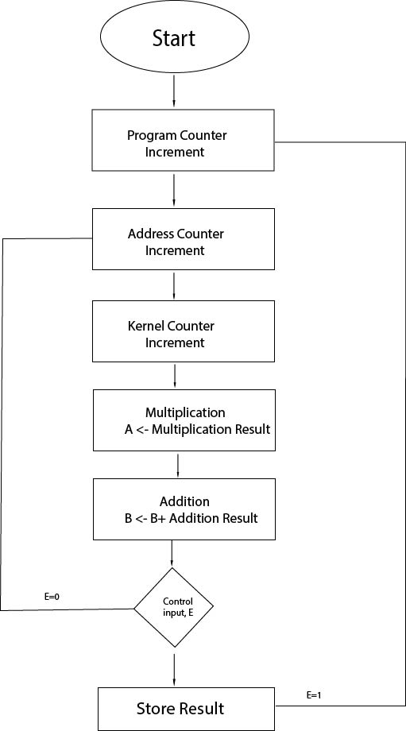
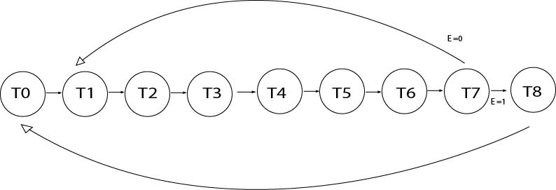
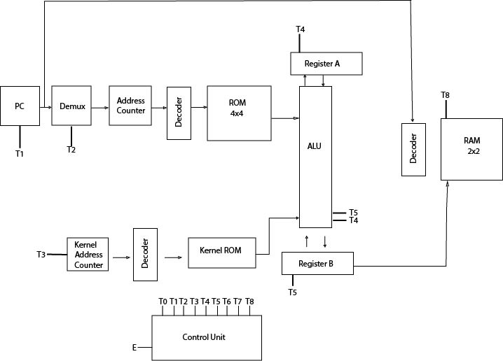
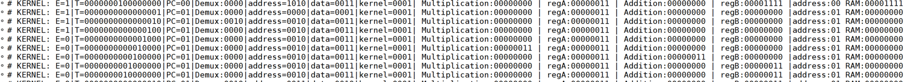

# 4x4 4-bit Image Convolution Using 3x3 Kernel Hardware Implementation

## Introduction
This project implements a **4x4 image convolution system** using a **3x3 kernel** in **Verilog**. Convolution is a fundamental operation in image processing used for **feature extraction, edge detection, and filtering**. The system is designed using **digital logic and finite state machines (FSM)** to ensure structured execution.

## Features
- Implements **4x4 image convolution** with a **3x3 kernel**.
- FSM-based control for structured data processing.
- Utilizes **registers, ALU, memory units**, and control logic.
- Designed in **Verilog** and tested using **hardware simulation tools**.

## Project Structure
```
├── Convolution
│   ├── src
│   │   ├── control_unit.v
│   │   ├── decoder4to16.v
│   │   ├── D_Flip_Flop.v
│   │   ├── control_unit_tb.v
│   │   ├── program_counter.v
│   │   ├── BreadBoard.v  # Top module for simulation
│   │   ├── control_tb.v
│   │   ├── Demux_1x4.v
│   │   ├── counter_one.v
│   │   ├── control_two.v
│   │   ├── control_three.v
│   │   ├── control_four.v
│   │   ├── Databus_4bit.v
│   │   ├── ROM.v
│   │   ├── kernel.v
│   │   ├── kernel_counter.v
│   │   ├── half_adder.v
│   │   ├── full_adder.v
│   │   ├── four_bit_adder.v
│   │   ├── multiplier_4x4.v
│   │   ├── eight_bit_adder.v
│   │   ├── ALU.v
│   │   ├── register_8bit.v
│   │   ├── databus_2bit.v
│   │   ├── RAM.v
│   │   ├── decoder2to4.v
│   │   ├── tb_RAM.v
│   │   ├── tb_counter_one.v
│   │   └── convolution library
├── docs
│   ├── report.pdf
│   ├── flowchart.jpg
│   ├── state_diagram.jpg
│   ├── block_diagram.jpg
│   ├── result_image.PNG  # Added result image from report
├── README.md
├── Makefile
└── LICENSE
```

## System Design
The system consists of the following main components:
1. **Program Counter (PC)** – Controls the sequence of operations.
2. **Address Counter** – Generates address sequences for image processing.
3. **Demultiplexer (Demux) & Decoder** – Directs signals to the correct data blocks.
4. **Kernel ROM** – Stores the 3x3 convolution kernel.
5. **Image ROM** – Stores the 4x4 image data.
6. **ALU (Arithmetic Logic Unit)** – Performs multiplication and addition for convolution.
7. **Registers** – Intermediate storage for computational results.
8. **RAM** – Stores final convolution results.
9. **Control Unit** – Manages FSM-based execution flow.

## Inputs and Outputs
- **Inputs:** 4x4 image matrix, 3x3 kernel matrix.
- **Outputs:** Convolution result stored in RAM.

## Implementation Details
1. The system starts with **program counter increment**.
2. The **address and kernel counters** update accordingly.
3. **Multiplication and addition** operations are performed via ALU.
4. The control unit manages FSM states for **efficient execution**.

## Results
- The system successfully computes **4x4 image convolution**.
- **State transitions** ensure structured data flow.
- **Final results are stored in RAM** and can be retrieved for further processing.

### Result Images
Below are some of the result images generated from the simulation:







## Future Improvements
- Extend the design for **larger image sizes**.
- Optimize **memory access** for improved performance.
- Implement **advanced convolution techniques** for deep learning applications.

## How to Run the Simulation in Active-HDL
### **Opening the Project in Active-HDL**
1. **Open Active-HDL.**
2. **Load the Project:**
   - Click on **File → Open Workspace**.
   - Navigate to the project directory and select **2D_Conv.aws**.
   - Click **Open**.
3. **Compile the Design:**
   - In the **Design Browser**, right-click on the top-level module **BreadBoard.v**.
   - Select **Compile All**.

### **Running the Simulation**
4. **Initialize Simulation:**
   - Open **BreadBoard.v** in the design hierarchy.
   - Click on **Simulation → Initialize Simulation**.
   - Set necessary inputs as required.
   - Click **Run** to start the simulation.

### **Viewing the Results**
5. **Open the Waveform Viewer:**
   - Inspect the convolution results.
   - Load signals of interest.

## License
This project is licensed under the MIT License - see the [LICENSE](LICENSE) file for details.

## Author
**Afiat Khan Tahsin**  
Department of Computer Science and Engineering  
Khulna University of Engineering & Technology, Bangladesh

